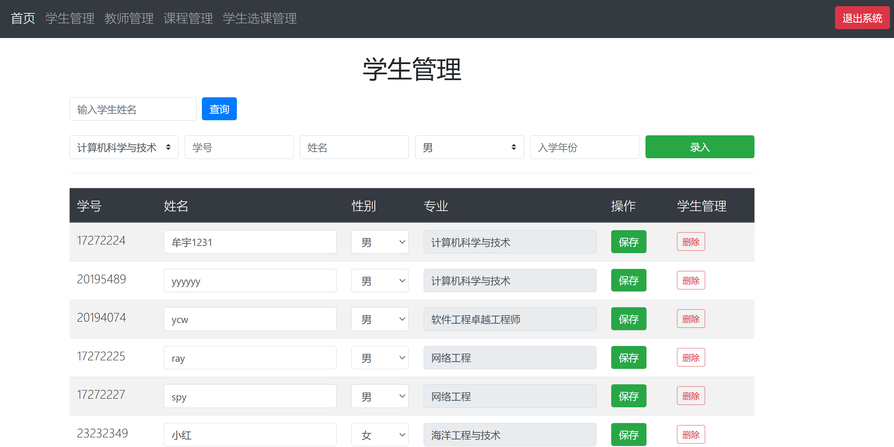

# README

# 数据库设计

1. **管理员表 (`manager`)**
    - **主键**: `ManagerNum`
    - 管理员表主要用于存储系统管理员的信息，通常与其他表没有直接的外键关系。
2. **学生表 (`student`)**
    - **主键**: `StudentNum`
    - **外键**: `MajorNum`（引用 `major` 表）
    - 学生表存储学生的基本信息，每个学生都与一个专业（`major`）相关联。
3. **老师表 (`teacher`)**
    - **主键**: `TeacherNum`
    - **外键**: `DeptNum`（引用 `dept` 表）
    - 老师表存储教师的基本信息，每位教师都与一个系（`dept`）相关联。
4. **课程表 (`course`)**
    - **主键**: `CourseNum`
    - **外键**: `DeptNum`（引用 `dept` 表）
    - 课程表存储课程的基本信息，每门课程都与一个系（`dept`）相关联。
5. **选课表 (`course_select_table`)**
    - **主键**: 复合主键 (`StudentNum`, `CourseNum`, `TeacherNum`)
    - **外键**:
        - `StudentNum`（引用 `student` 表）
        - `CourseNum`（引用 `course` 表）
        - `TeacherNum`（引用 `teacher` 表）
    - 选课表用于记录学生选修的课程及其对应的教师信息，建立了学生、课程和教师之间的多对多关系。
6. **课程教师表 (`course_teacher`)**
    - **主键**: 复合主键 (`CourseNum`, `TeacherNum`)
    - **外键**:
        - `CourseNum`（引用 `course` 表）
        - `TeacherNum`（引用 `teacher` 表）
    - 课程教师表用于记录每门课程的授课教师，建立了课程与教师之间的多对多关系。
7. **专业表 (`major`)**
    - **主键**: `MajorNum`
    - **外键**: `DeptNum`（引用 `dept` 表）
    - 专业表存储专业的基本信息，每个专业都与一个系（`dept`）相关联。
8. **系表 (`dept`)**
    - **主键**: `DeptNum`
    - 系表存储各个系的基本信息，作为其他表的外键引用。

总结

- **管理员**表与其他表没有直接的外键关系，主要用于管理系统。
- **学生**与**专业**之间通过`MajorNum`建立关系。
- **老师**与**系**之间通过`DeptNum`建立关系。
- **课程**与**系**之间通过`DeptNum`建立关系。
- **选课表**通过复合主键将**学生**、**课程**和**教师**联系在一起。
- **课程教师表**通过复合主键将**课程**和**教师**联系在一起。

这些关系构成了一个完整的学生管理系统，能够有效地管理学生、教师、课程及其之间的关系。

# 系统功能简介和截图

测试账号：

管理员：000 admin

学生 ： 17272224    admin

老师：0002  admin

不同的账号登录看到的是不同的功能。

## 管理员：

1、学生管理

- 录入学生：校验学号冲突。
- 删除学生：首先把该学生的关联的选课记录清除，然后再删除学生信息。
- 修改学生信息。

2、教师管理

- 录入教师：校验工号冲突。
- 修改教师信息。

3、课程管理

- 创建、删除课程。
- 分配课程到某教师（一个课程可以有多个老师同时开设，每个老师的课程容量不同）。
- 修改课程信息。

4、学生选课管理

- 可以修改某个学生的签课（缺少选课人数和课程容量的校验）和退课。
- 可以删除所设课程。




## 学生：

1、信息查询

- 个人基本信息（此处可以修改登录密码）。
- 专业信息。
- 学院信息。

2、根据专业和授课教师选课和退课。

3、查询课程成绩。


## 老师：

1、个人基本信息。

2、选课详情（所授课程以及选择该课程的学生）。

3、录入学生成绩。


# 技术选型和关键代码

系统后端采用Python的Flask框架，前端是html基础页面（简单用bootstrap渲染了一下），数据库采用Sqlite3。

- `- VX号: RELIABLE_YANG 添加时请您注明来意。`
- `详细了解该系统功能、获取数据库文件、对该系统基础功能的定制化改造、关于其他类型系统承接等都可以咨询。- 注意目前系统使用的数据库为sqlite3，如有需要可以改为MySQL，功能均可正常使用。`

## 1、应用程序的特性和功能

1. **用户认证**：支持学生、教师和管理员的登录、登出和权限管理。
2. **课程管理**：允许管理员添加、删除和管理课程及教师的课程分配。
3. **选课系统**：学生可以选择和退选课程，查看课程信息和教师信息。
4. **成绩管理**：教师可以录入和查询学生的成绩。
5. **信息管理**：管理员可以管理学生和教师的信息，包括添加、删除和更新。

以下是关键操作的代码片段：

```python
@app.route('/login', methods=('GET', 'POST'))
def login():
    # ... existing code ...
    if request.method == 'POST':
        username = request.form['username']
        password = request.form['password']
        # ... existing code ...
        if error is None:
            login_user(user, remember=remember)
            # ... existing code ...
    return render_template('login.html')

@app.route('/course_select/<CourseNum>/<TeacherNum>', methods=['GET',])
@login_required
def course_select(CourseNum, TeacherNum):
    if isinstance(current_user._get_current_object(), Student):
        # ... existing code ...
        if CourseNum in course_selected:
            flash('错误：您已选课程中存在该门课程！')
        else:
            course_select = Course_select_table(current_user.StudentNum, CourseNum, TeacherNum)
            db.session.add(course_select)
            db.session.commit()
            flash('您已成功选择该门课程。')
        return redirect(url_for('course'))

```

## 2、面临的挑战及解决方案

1. **用户权限管理**：
    - **挑战**：确保不同用户（学生、教师、管理员）只能访问其权限范围内的功能。
    - **解决方案**：使用 `@login_required` 装饰器和用户类型检查，确保用户在访问特定路由时具有适当的权限。
2. **数据一致性**：
    - **挑战**：在添加、删除或更新数据时，确保数据库中的数据一致性。
    - **解决方案**：在每个操作后使用 `db.session.commit()` 提交更改，并在删除操作前先删除相关联的数据。
3. **错误处理**：
    - **挑战**：处理用户输入错误（如登录失败、课程选择错误等）。
    - **解决方案**：使用 `flash` 消息向用户反馈错误信息，并在表单提交时进行输入验证。

如果您需要更详细的文档或其他特定部分的代码片段，请告诉我！

## 3、前后端交互逻辑

1. **用户请求**：
    - 用户通过前端界面（如HTML表单）提交请求，例如登录、选课、查询成绩等。
    - 这些请求通过HTTP方法（如GET、POST）发送到后端的特定路由。
2. **后端处理**：
    - 后端接收到请求后，使用Flask框架的路由处理相应的请求。例如，`@app.route('/login', methods=('GET', 'POST'))` 处理登录请求。
    - 后端会从请求中提取数据（如用户名和密码），并进行相应的逻辑处理，如验证用户身份、查询数据库等。
3. **数据库交互**：
    - 后端通过ORM（SQLAlchemy）与数据库进行交互，执行查询、插入、更新或删除操作。
    - 例如，在登录过程中，后端会查询数据库以验证用户的凭据。
4. **响应生成**：
    - 处理完请求后，后端会生成响应，通常是一个HTML页面或JSON数据。
    - 例如，成功登录后，后端会重定向用户到相应的页面（如学生主页或教师主页），或者返回一个JSON对象以供前端处理。
5. **前端更新**：
    - 前端接收到后端的响应后，更新用户界面。
    - 如果是HTML页面，浏览器会加载新的页面；如果是JSON数据，前端会使用JavaScript动态更新页面内容。

以下是一些关键代码片段，展示了前后端交互的逻辑：

```python
@app.route('/login', methods=('GET', 'POST'))
def login():
    if request.method == 'POST':
        username = request.form['username']
        password = request.form['password']
        # 验证用户身份
        user = Student.query.filter_by(StudentNum=username).first() or Teacher.query.filter_by(TeacherNum=username).first()
        if user and user.check_password(password):
            login_user(user)
            return redirect(url_for('student_index' if isinstance(user, Student) else 'teacher_index'))
        flash('用户名或密码错误！')
    return render_template('login.html')

```

```python
@app.route('/course_select/<CourseNum>/<TeacherNum>', methods=['GET',])
@login_required
def course_select(CourseNum, TeacherNum):
    if isinstance(current_user._get_current_object(), Student):
        # 处理选课逻辑
        course_select = Course_select_table(current_user.StudentNum, CourseNum, TeacherNum)
        db.session.add(course_select)
        db.session.commit()
        flash('您已成功选择该门课程。')
        return redirect(url_for('course'))
```